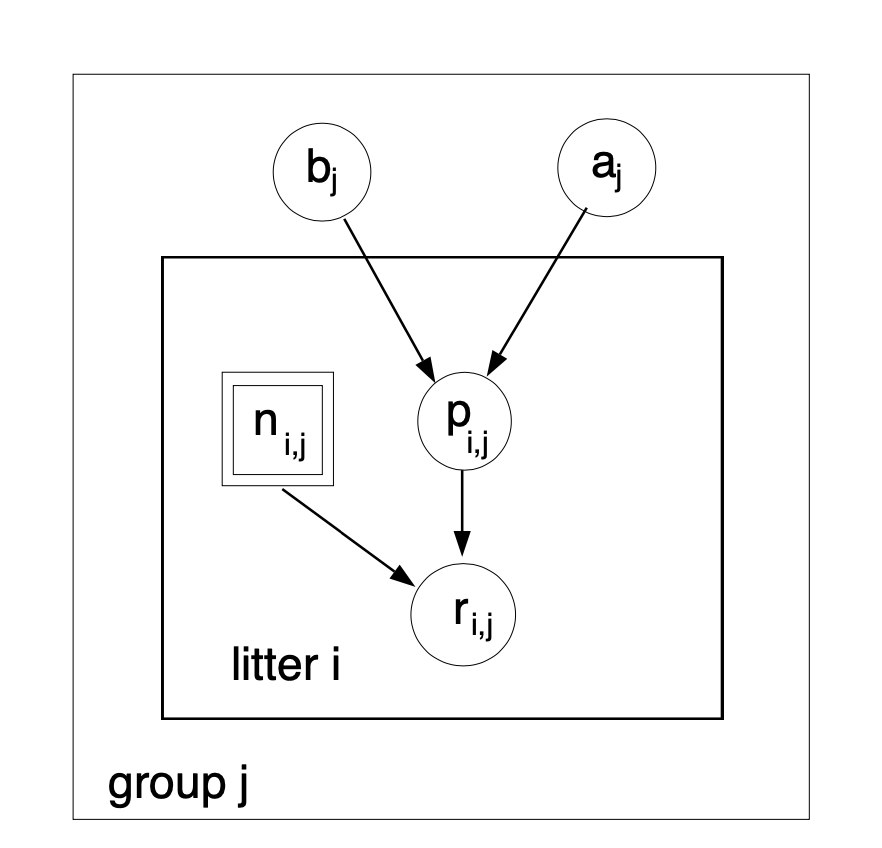

```{r setup, include=FALSE}
knitr::opts_chunk$set(echo = TRUE,
                      cache = TRUE)
has_ggplot2 <- require(ggplot2)
has_mcmcplots <- require(mcmcplots)
has_coda <- require(coda)
generate_original_results <- FALSE

ggplot2::theme_set(theme_bw())
knitr::opts_chunk$set(tidy.opts = list(width.cutoff = 60), tidy = TRUE)
```

### Acknowledgements

.pull-left[


Perry de Valpine
(UC Berkeley)
]

.pull-right[


Chris Paciorek
(UC Berkeley)
]

---
# What Is NIMBLE?

**N**umerical **I**nference for statistical **M**odels using 
**B**ayesian and **L**ikelihood **E**stimation.

.pull-left[

]

.pull-right[

]

---
# What Is NIMBLE?

**N**umerical **I**nference for statistical **M**odels using **B**ayesian and **L**ikelihood **E**stimation.


- A framework for hierarchical statistical models and methods.

- A nearly drop-in alternative to WinBUGS, OpenBUGS and JAGS.

- An extension of the BUGS language for writing new functions and distributions.

- A configurable system for MCMC.

- A library of other methods.
    - Sequential Monte Carlo (particle filtering) (via the `nimbleSMC` package)
    - Monte Carlo Expectation Maximization (maximum likelihood)

- A model-generic programming system to write new analysis methods.

---

### NIMBLE components

* Model language: A new, extended dialect of BUGS/JAGS for specifying models

* A package of algorithms (MCMC, SMC, MCEM)

* Algorithm language: nimbleFunctions, embedded within R for writing algorithms

* Compiler: Generates and compiles C++ from models and algorithms
---
# Why NIMBLE?

Here are some of the features you can do in NIMBLE that we are most excited about and that distinguish NIMBLE from other software:

- customize your MCMCs, including choosing what parameters to block

- define your own distributions and functions for use in BUGS code

- use a variety of algorithms on your model, including MCMC, sequential Monte Carlo (particle filtering), and MCEM

- write an algorithm in our system for easy dissemination to others, including your own MCMC samplers

- call out to arbitrary external (C++, R, etc.) code within a model or algorithm

- compile mathematical operations in R without needing to know or write C or C++
---
# Why not NIMBLE?

- For MCMCs that rely heavily on Gibbs sampling, JAGS may be a bit faster because of more efficient internal implementation of the calculations.

- For certain model structures, Hamiltonian Monte Carlo, such as implemented in Stan or PyMC3, may work better than the default MCMC samplers in NIMBLE.
   1. That said, in a number of examples we've tried we've been able to achieve comparable or better performance either out-of-the-box or with some relatively simple modifications to the model or the MCMC samplers.
   2. And yet, sometimes customization is time-consuming and requires specialized knowledge.
  
- NIMBLE can take a long time to build algorithms for models that have tens of thousands or more nodes (though once built, the algorithm run times can be quite good). We anticipate big improvements in future versions of NIMBLE.

---
# Getting help with NIMBLE

* User manual ([html](https://r-nimble.org/html_manual/cha-welcome-nimble.html) or [pdf](https://r-nimble.org/manuals/NimbleUserManual.pdf))

* Post to the [NIMBLE user group](https://groups.google.com/forum/#!forum/nimble-users)

* If necessary, email [nimble.stats@gmail.com](the NIMBLE development team)

* Follow announcements via the [NIMBLE announcements list](https://groups.google.com/forum/#!forum/nimble-announce)

---

## A basic example

Here we'll give a simple example of building a model and running a default MCMC. Other modules will show how one can fit the model and give more detail on various features of NIMBLE.

We'll use the *litters* model example from BUGS. The data set describes survival of rat pups in a simple experiment.

  - There are `G=2` groups of rat litters, with `N=16` litters (i.e., mothers) in each group, and a variable number of pups in each litter.

  - We observe the number of rat pups who survived `r[i,j]` among `n[i,j]`
  
  - Survival of the pups in a litter is governed by a survival probability for each litter, `p[i,j]`.

---
## Specifying the code for a model

Model for the data: the probabilities for the litters within a group are considered to come from a common distribution, thereby borrowing strength across the litters in a group.


\begin{align}
  r_{ij} &\sim \mbox{Bin}(n_{ij}, p_{ij}), \quad i = 1, 2,\quad  j = 1, \ldots, N \\
  p_{1,j} &\sim \mbox{Beta}(a_1, b_1), \quad j = 1, \ldots, N \\
  p_{2,j} &\sim \mbox{Beta}(a_2, b_2), \quad j = 1, \ldots, N
\end{align}


Priors:
$$
  a_i \sim Gamma(1, 0.001),\quad  b_i \sim Gamma(1, 0.001),\quad i = 1, 2
$$
Other quantities of interest: 
- mean $\mu_i = a_i/(a_i + b_i)$ 
- dispersion $\theta_i = 1/(a_i + b_i)$ 

---
## Specifying the code for a model


```{r echo = FALSE, out.width="500px", fig.align='center'}


```

---
## Specifying the code for a model

We can walk through some of details via the comments in the BUGS code. The model is a binomial GLMM with $G=2$ groups of rats litters, and exchangeable litter-specific survival probabilities for the litters in each group. 

```{r, litters-code}
library(nimble)
littersCode <- nimbleCode({
  for (i in 1:G) {
     for (j in 1:N) {
        # Likelihood (data model)
        r[i,j] ~ dbin(p[i,j], n[i,j])
        # Latent process (random effects)
        p[i,j] ~ dbeta(a[i], b[i]) 
     }
     # Priors for hyperparameters (not reccomended)
     a[i] ~ dgamma(1, .001)
     b[i] ~ dgamma(1, .001)
     ## Mean and dispersion reparameterization
     mu[i] <- a[i] / (a[i] + b[i])
     theta[i] <- 1 / (a[i] + b[i])
   }
})
```

You can also load it directly from the standard BUGS example file formats (see `help(readBUGSmodel)`).

---
## Build the model


```{r, message=FALSE}
## data and constants as R objects
G <- 2
N <- 16
n <- matrix(c(13, 12, 12, 11, 9, 10, 
              9, 9, 8, 11, 8, 10, 13, 10, 12, 9, 10, 9, 10, 5, 9, 9, 13, 
              7, 5, 10, 7, 6, 10, 10, 10, 7), nrow = 2)
r <- matrix(c(13, 12, 12, 11, 9, 10, 9, 9, 8, 10, 8, 9, 
     12, 9, 11, 8, 9, 8, 9, 4, 8, 7, 11, 4, 4, 5, 5, 3, 7, 3, 7, 0), 
     nrow = 2)
              
littersConsts <- list(G = G, N = N, n = n)
littersData <- list(r = r)
littersInits <- list(a = c(2, 2), b = c(2, 2))

```

---

.scroll-box-20[
```{r, message = TRUE}
## create the NIMBLE model object
littersModel <- nimbleModel(littersCode, 
          data = littersData, constants = littersConsts, inits = littersInits)
```
]

---
## Compiling a model

In general, you'll want a version of the model that allows for fast computation (this can then be used by any algorithms you use on the model).

To create a fast compiled version of the model, you simply do this.

```{r, compile-model}
cLittersModel <- compileNimble(littersModel)
```
---

## Setting up an MCMC such that it could be customized

Much of the power of NIMBLE comes from the ability to **customize algorithms**, including how MCMC sampling works.

In order to talk about MCMC customization later today, we first need to see the 'manual' steps of running an MCMC in NIMBLE 

[NIMBLE workflow](workflow.png):

 1. configure the MCMC (via `configureMCMC()`)
 2. build the MCMC (via `buildMCMC()`)
 3. create a compiled version of the MCMC (via `compileNimble()`)
 4. run the MCMC (via `runMCMC()`)
 5. assess and use the MCMC samples (e.g., using CODA tools)

Note that `nimbleMCMC()` combines steps 1-4 (and in fact does not even require you to create the model). See the last slide.

---
## Configuring a basic MCMC

At a high level, NIMBLE (like BUGS and JAGS) uses a "Gibbs" style MCMC that loops over parameters.

  - Individual samplers (e.g., conjugate, Metropolis, slice, etc.) are assigned to individual parameters or blocks of parameters.

  - In contrast, Stan and PyMC3 assign a Hamiltonian Monte Carlo sampler to the entire vector of parameters. 

  - Setting up and running an MCMC in NIMBLE in this way takes a few more steps than in BUGS or JAGS, but with the benefit of giving the user much more control of how the MCMC operates.
---

First we *configure* the MCMC, which means setting up the samplers to be used for each node or group of nodes. NIMBLE provides a default configuration, but we'll see shortly how you can modify that. 

```{r, configureMCMC}
littersConf <- configureMCMC(littersModel, print = TRUE)
```
You also specify the nodes for which you'd like to get the MCMC samples as output. (NIMBLE defaults to only monitoring the "top-level" nodes, i.e., hyperparameters with no stochastic parents.)

```{r, monitor}
littersConf$addMonitors(c('a', 'b', 'p'))
```

---

## Building the MCMC algorithm for the model 

Next we'll build the MCMC algorithm for the model under the default configuration. And we'll create a compiled (i.e., C++) version of the MCMC that is equivalent in functionality but will run much faster.

```{r build-mcmc}
littersMCMC <- buildMCMC(littersConf)
cLittersMCMC <- compileNimble(littersMCMC, project = littersModel)
```

(The `project` argument helps us manage all the C++ that is generated for a given analysis. In general the project can be referenced using the name of the original (uncompiled) model.)

---

# Running the MCMC

Now let's run the MCMC.
.scroll-box-14[
```{r run-mcmc}
niter <- 5000
nburn <- 1000
set.seed(1)
inits <- function() {
      a <- runif(G, 1, 20)
      b <- runif(G, 1, 20)
      p <- rbind(rbeta(N, a[1], b[1]), rbeta(N, a[2], b[2]))
      return(list(a = a, b = b, p = p))
}             
samples <- runMCMC(cLittersMCMC, niter = niter, 
                   nburnin = nburn,
                   inits = inits,
                   nchains = 3, samplesAsCodaMCMC = TRUE)
```
]

**Side note**: We don't recommend running the R version of the MCMC for very many iterations in part because iterating in R is slow and in part because iterating with a model in NIMBLE requires even more overhead. The R and C MCMC samples are the same, so you can use the R MCMC for debugging. It's possible to step through the code line by line using R's debugging capabilities (not shown).

---

## Working with MCMC output

Now let's look at the MCMC performance from one of the chains.

```{r output-mcmc, fig.height=6, fig.width=12, fig.cap='', fig.show="hide"}
samples1 <- samples[[1]]

par(mfrow = c(2, 2), mai = c(.6, .5, .4, .1), mgp = c(1.8, 0.7, 0))
ts.plot(samples1[ , 'a[1]'], xlab = 'iteration',
     ylab = expression(a[1]), main = expression(a[1]))
ts.plot(samples1[ , 'b[1]'], xlab = 'iteration',
     ylab = expression(b[1]), main = expression(b[1]))
ts.plot(samples1[ , 'a[2]'], xlab = 'iteration',
     ylab = expression(a[2]), main = expression(a[2]))
ts.plot(samples1[ , 'b[2]'], xlab = 'iteration',
     ylab = expression(b[2]), main = expression(b[2]))
```

---

`)

Not good. We'll explore different sampling strategies that fix the problems in later modules.

---
## Using CODA

NIMBLE does not provide any MCMC diagnostics. (At least not yet; there's no reason one couldn't write code for various diagnostics using the NIMBLE system.)  But one can easily use CODA or other R packages with the MCMC output from a NIMBLE MCMC.

```{r coda, results = 'show'}
library(coda, warn.conflicts = FALSE)
crosscorr(samples1[ , c('a[1]', 'b[1]', 'a[2]', 'b[2]')])

head(effectiveSize(samples1))  ## ESS
```

---
## Assessing MCMC performance from multiple chains

To apply the commonly used Gelman-Rubin potential scale reduction factor diagnostic, we'll need the multiple chains.

The Gelman–Rubin diagnostic evaluates MCMC convergence by analyzing the difference between multiple Markov chains. The convergence is assessed by comparing the estimated between-chains and within-chain variances for each model parameter (values close to 1 are good).

.scroll-box-16[
```{r}
gelman.diag(samples)
```
]
---

```{r gelman-rubin, fig.cap='', fig.height=6, fig.width=12, fig.show="hide" }
## and here's a graphical representation of the information
par(mfrow = c(1, 2))

ts.plot(samples[[1]][ , 'a[1]'], xlab = 'iteration',
     ylab = expression(a[1]), main = expression(a[1]))

sq <- seq_along(samples[[1]][ , 'a[1]'])

for(i in 2:3)
      lines(sq, samples[[i]][ , 'a[1]'], col = i)

ts.plot(samples[[1]][ , 'b[1]'], xlab = 'iteration',
     ylab = expression(b[1]), main = expression(b[1]))

sq <- seq_along(samples[[1]][ , 'b[1]'])

for(i in 2:3)
      lines(sq, samples[[i]][ , 'b[1]'], col = i)
```
---

`)

---

## Other MCMC tools in NIMBLE

  - WAIC for model comparison

  - variable selection via reversible jump MCMC

  - cross-validation 

  - (coming soon) calibrated posterior predictive p-values

---

## One-click MCMC operation: `nimbleMCMC`

If all you want to do is run an MCMC, NIMBLE's fine-grained control might not be so interesting to you, in which case you can just use `nimbleMCMC()` without using `nimbleModel()` to create the model. But by providing an explicit model object, we allow you to operate the model and program with it (next module).

.scroll-box-20[
```{r}
samples <- nimbleMCMC(code = littersCode, 
                      data = littersData, 
                      inits = littersInits,
                      constants = littersConsts, 
                      monitors = c("a", "b", "p"),
                      thin = 1, niter = 1100,
                      nburnin = 100, nchains = 1,
                      setSeed = TRUE)
```
]

--- 

```{r litters-nimbleMCMC, fig.cap='', fig.width=12, fig.height=8, fig.show='hide'}

par(mfrow = c(2, 2), cex = 1.2, mgp = c(1.8, 0.7, 0), mai = c(0.75, 0.75, 0.1, 0.1))
ts.plot(samples[ , 'a[1]'], xlab = 'iteration', ylab = expression(a[1]))
ts.plot(samples[ , 'a[2]'], xlab = 'iteration', ylab = expression(a[2]))
ts.plot(samples[ , 'b[1]'], xlab = 'iteration', ylab = expression(b[1]))
ts.plot(samples[ , 'b[2]'], xlab = 'iteration', ylab = expression(b[2]))
```

---

`)
